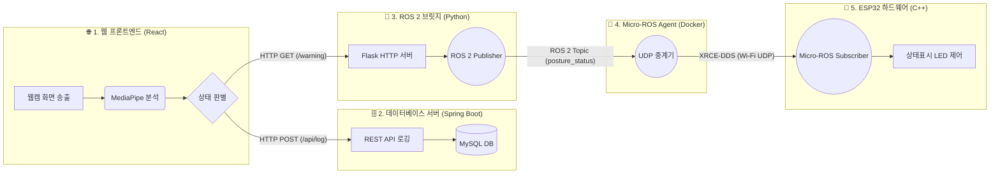

# 🌿 ZenDesk (스마트 데스크 대시보드)

사용자의 자세와 눈 건강을 실시간으로 분석하여 거북목을 예방하고 최적의 작업 환경을 제공하는 **IoT 및 ROS 2 기반 스마트 데스크 헬스케어 시스템**입니다.

웹 브라우저의 고성능 비전 분석과 산업 표준 로봇 운영체제(ROS 2)를 융합하여, 원격의 하드웨어 디바이스로 지연 없는 즉각적인 물리적 피드백을 제공합니다.

---

## ✨ 주요 기능 및 학술적 근거

### 1. 고성능 실시간 자세 분석 (`MediaPipe Pose` 활용)
- **거북목 감지 (CVA Analysis):** 신체 주요 뼈대를 추적하여 정상 CVA 기준(50도)을 바탕으로 상대적/절대적 하한선(40도)을 돌파 시 즉각적인 거북목을 판별합니다.
- **정적 판별 방식:** 움직임보다는 뼈대 각도의 순간 상태가 중요하므로 시간의 개입 없이 정밀한 수학적 캘리브레이션을 수행합니다.
- **어깨 비대칭 및 모니터 거리 측정:** 한국인 평균 얼굴 너비 비율 연산을 통해 적정 모니터 거리(40~60cm)를 유지하는지 모니터링합니다.

### 2. 눈 피로도 및 깜빡임 감지 (`MediaPipe Face Mesh` 활용)
- **눈 깜빡임 카운팅 (EAR):** 468개의 정밀한 안면 랜드마크를 추출하여, 눈의 종횡비(EAR)가 0.2 미만으로 떨어지는 순간을 캐치합니다.
- **동적 시간 상태머신 필터링:** 프레임 스킵이나 노이즈를 방지하기 위해, 눈을 감고 있는 시간이 `50ms ~ 500ms` 사이일 때만 정상적인 1회 깜빡임으로 인정하는 고정밀 로직을 적용했습니다.
- **피로도 경고:** 분당 깜빡임(BPM)이 15회 이하로 떨어지면 "안구 건조증 위험" 경고를 발생시킵니다.

### 3. ROS 2 기반 IoT 하드웨어 피드백 (Micro-ROS)
- **즉각적인 경고:** 웹사이트(React)에서 감지된 경고 신호가 Python 브릿지 서버를 거쳐 ROS 2 토픽(`posture_status`)으로 변환됩니다.
- **무선 하드웨어 연동:** ESP32가 Wi-Fi UDP를 통해 Micro-ROS Agent에 접속하여 상태를 구독하고, 빨간색/초록색 LED로 사용자에게 실시간 상태를 표시합니다.

---

## 🏗 사용 기술 스택 (Technology Stack)

### 🌐 Frontend (웹 애플리케이션)
- **Framework:** React, Vite
- **UI/UX:** Vanilla CSS (Glassmorphism 디자인 적용), Lucide React
- **Vision AI:** MediaPipe Pose (자세 판별), MediaPipe Face Mesh (눈 깜빡임 판별)
- **Communication:** Axios, Fetch API

### 🗄️ Database & Backend (데이터 로깅 및 회원 관리)
- **Framework:** Spring Boot 3, Java 17
- **Database:** MySQL 8.0, Spring Data JPA
- **Security:** Spring Security, OAuth 2.0 (Google, Naver 로그인)

### 🌉 ROS 2 Bridge & Hardware (로봇 제어 통신망)
- **Bridge Server:** Python 3, Flask, rclpy (ROS 2 Python Client)
- **Micro-ROS Agent:** WSL2 (Ubuntu), Docker
- **Hardware Node:** ESP32 (Arduino C++, micro_ros_arduino)

---

## 📐 시스템 아키텍처 및 데이터 흐름

---

## 🚀 시작하기

### 1. 백엔드 설정 (Spring Boot)
1. MySQL에 `turtle_neck_db` 데이터베이스를 생성합니다.
2. `backend/src/main/resources/application.properties` 에서 DB 접속 정보를 확인합니다.
3. OAuth 2.0 API 키를 `application-secret.properties`에 입력합니다.
4. 백엔드 서버 실행: `cd backend && ./gradlew bootRun`

### 2. 프론트엔드 설정 (React)
1. `frontend` 디렉토리로 이동하여 패키지를 설치합니다: `npm install`
2. 프론트엔드 서버 실행: `npm run dev`

### 3. ROS 2 통신망 및 하드웨어 설정 (Micro-ROS)
1. **Agent 실행:** WSL2 환경에서 Docker를 통해 Micro-ROS Agent를 UDP 포트 8888로 구동합니다.
   - `docker run -d --rm -p 8888:8888/udp microros/micro-ros-agent:jazzy udp4 --port 8888`
2. **Bridge 실행:** Windows 또는 WSL2에서 파이썬 중계 서버를 실행합니다.
   - `python ros2_web_bridge.py`
3. **ESP32 업로드:** `esp32_server/esp32_server.ino` 파일 내의 `ssid`, `password`, 그리고 `agent_ip_str`(PC의 Wi-Fi IP)를 수정한 뒤 보드에 업로드합니다.

---

## 📸 대시보드 미리보기
- **실시간 분석:** 카메라 화면 상단에 한글 HUD(자세 점수, EAR, 깜빡임)가 실시간 시각화됩니다.
- **사이드 위젯:** 포커스 타이머, 눈 피로도 모니터, 실시간 자세 분석 차트가 배치되어 있습니다.
- **기록 확인:** 캘린더의 각 날짜를 클릭하여 과거의 정밀한 자세 건강 점수(10분 단위 누적 로깅)를 확인할 수 있습니다.
  

